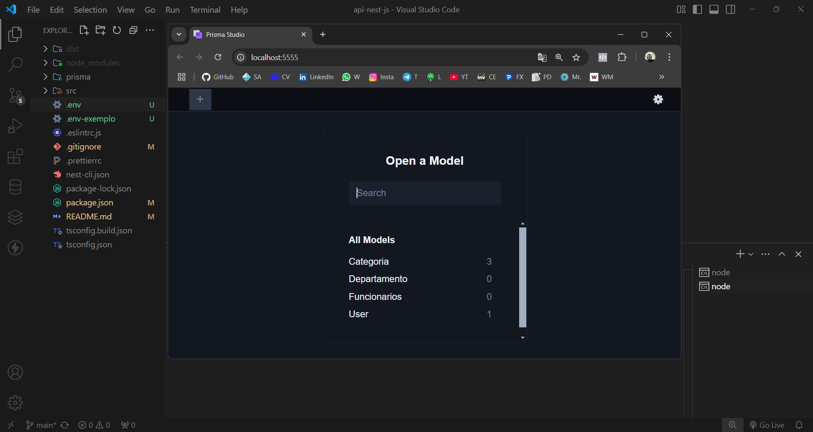

> ### Criando projeto

<br/><br/>

<hr/>

* <b>0</b> Somente ser for a primeira que estiver usando o <b>NestJS</b>
```
npm i -g @nestjs/cli
```

* <b>1</b> depois de selecionar uma pasta
```
npx nest new api
```
* <b>1.1</b> entrar na pasta
```
cd api
```
> ### Inciando prisma ORM Gerenciador de Banco
* <b>2</b> Instalando o prisma
```
npm install prisma --save-dev
```

* <b>3</b> Inciando o prisma <b style="color: 'green'">( Gera a pasta Prisma )</b>
```
npx prisma init
```
    
* <b>4</b> entrar na pasta prisma editar o schema.prisma
```
datasource db {
    provider = "sqlite"
    url      = env("DATABASE_URL")
}
```

* <b>5</b> editando o .env
```
DATABASE_URL="file:./dev.db"
```

* <b>6</b> Model entrar na pasta prisma editar o schema.prisma
```
model User {
     id   Int     @id @default(autoincrement())
    email String  @unique
    nome  String
    senha String

    createdAt        DateTime           @default(now())
    updatedAt        DateTime           @updatedAt
}
```

* <b>7</b> Criando migração com a tabela
```
npx prisma migrate dev --name init
```

* <b>8</b>  Abrindo o nosso prisma Studio Admin
```
npx prisma studio
```
> ### Caso baixe do Github
* <b>9</b>  no terminal na pasta do projeto
```
npm install
```